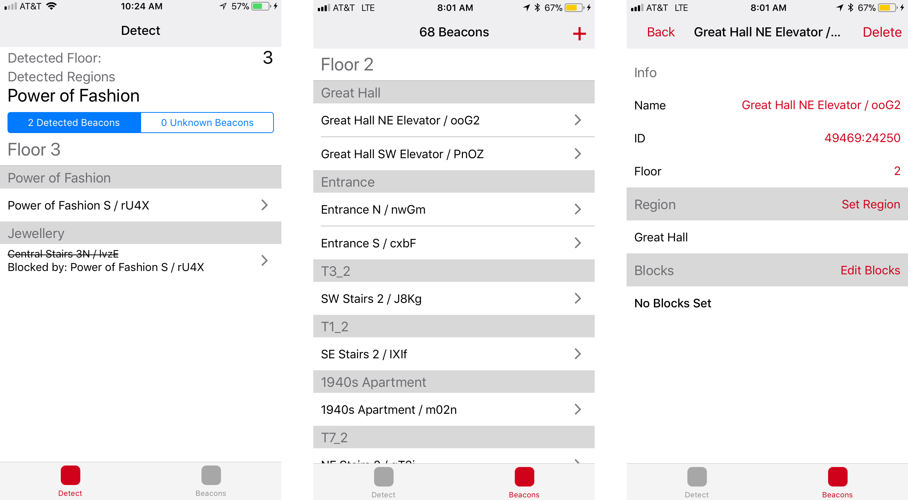
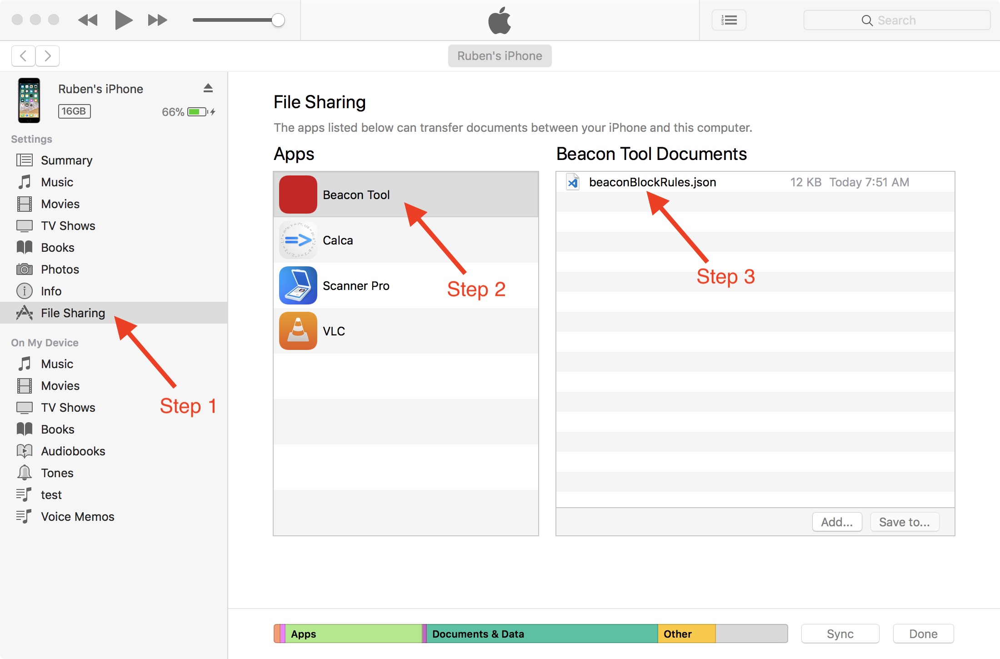

# Beacon Deployment Tool

Targets:
- iOS 10.0 or greater

### Description



This tool helps with the placement of Beacons for use in [Nordic Museum Audio Guide](https://github.com/NordicMuseum/Nordic-Museum-Audio-Guide). (Please see the Nordic Museum repo for a description of the [indoor location system](https://github.com/NordicMuseum/Nordic-Museum-Audio-Guide/blob/master/indoorLocation.md)) Given a beaconBlockRules.json file it will allow you walk around and see what regions are detected and why. (Which beacons are behind that regions and which beacons are blocking which ones.) This tool can also be used to generate the beaconBlockRules.json file that contains all the beacons, their blocks and their regions.

You upload and download these file to the app by using iTunes file sharing as shown below:



Innovation Studio is the design, development, and workflow laboratory at Carnegie Museums of Pittsburgh, where it supports a culture of innovation throughout the museums.


### Getting Started

1\. Install all React Native dependencies
[React Native getting started guide](https://facebook.github.io/react-native/docs/getting-started.html)

2\. Install project dependencies
```
yarn
```

3\. Run on the iOS simulator
```
react-native run-ios
```

Building for Release and/or to a real Device is an exercise left to the reader.
